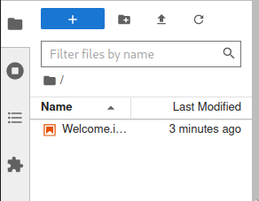

# Seismic Data Processing notebooks for Earthquake Seismology Class

## Running the notebooks

### Using Docker

#### Installing Docker

Follow the guides for your operating system:

- [Windows](https://docs.docker.com/desktop/install/windows-install/)
- [Mac](https://docs.docker.com/desktop/install/mac-install/)
- [Linux](https://docs.docker.com/desktop/linux/)

#### Running the Docker container

In the terminal window, first create and change into a working directory (e.g. `gpn455_eqseis_notebooks`)

```console
$ mkdir gpn455_eqseis_notebooks
$ cd gpn455_eqseis_notebooks
```

then run the following `docker run` command.

```console
$ docker run -v ${PWD}:/notebooks --rm -p 8888:8888 csmcgs/eqseis:2022
```

Command Explanation:
- `docker run` docker run command
- `-v ${PWD}:/notebooks` binds current working directory (host) to container's `/notebooks` directory.
- `--rm` removes container after shutdown (optional)
- `-p 8888:8888` bridges port 8888 between host and container. If your computer has some application using `8888` port it can be changed to another number (`8889`, `9000` e.g.).
- `csmcgs/eqseis:2022` docker image name that denotes username, image name and the version.


Copy the last url (it should look like: `http://127.0.0.1:8888/lab?token=...`) printed to the terminal to your web browser window. Open the `Welcome` page which can be seen in the left pane. Execute the notebook to get the latest exercises into your computer. Following the link should take you to the `Index` page.


